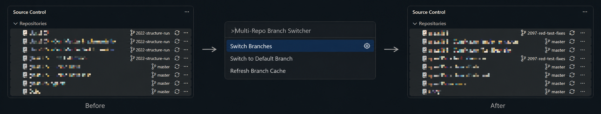
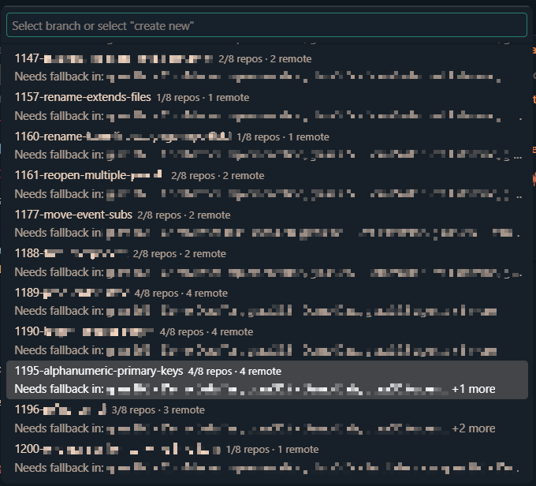
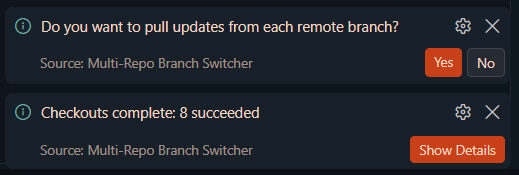
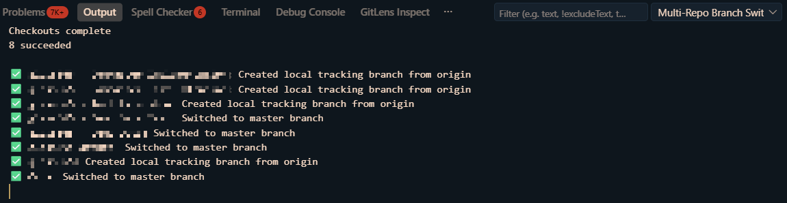

# Multi-Repo Branch Switcher

<p align="center">
  <strong>Keep every Git repository in a VS Code workspace on the right branch—without switching them one by one.</strong>
</p>

<p align="center">
  <a href="https://marketplace.visualstudio.com/items?itemName=WolframS.multi-repo-branch-switcher"></a>
  <a href="https://marketplace.visualstudio.com/items?itemName=WolframS.multi-repo-branch-switcher"></a>
  <a href="https://github.com/wolframs/multi-repo-checkout/blob/main/LICENSE"></a>
</p>

<p align="center">
  
</p>

Multi-Repo Branch Switcher coordinates branch checkout, creation, fallback, refresh, and cleanup across every Git repository detected by VS Code. It stays fast in large workspaces through cached refs and bounded concurrency, while making partial availability and unsafe repositories visible before they surprise you.

## 👁️‍🗨️ At a glance

| | Capability | What it gives you |
| --- | --- | --- |
| ⚡ | **Fast branch lookup** | Workspace-scoped ref caching and concurrent Git operations. |
| 🔎 | **Repository coverage** | Local, `origin`, and fallback context directly in the branch picker. |
| 🛡️ | **Optional preflight** | A ready/fallback/blocked plan before any checkout begins. |
| 🌐 | **Controlled fetching** | Refresh `origin` only when the cache expires, always, or never. |
| 🧹 | **Branch cleanup** | Preview and delete stale local branches while protecting important names. |
| 📋 | **Readable results** | Compact completion counts with line-by-line details on demand. |

## 🚀 Quick start

1. Open a VS Code workspace containing multiple Git repositories.
2. Open the Command Palette with <kbd>Ctrl+Shift+P</kbd> / <kbd>F1</kbd>, or <kbd>Cmd+Shift+P</kbd> on macOS.
3. Run **Multi-Repo Branch Switcher: Switch Branches**.
4. Review branch coverage and choose an existing branch—or select **Create New Branches for All Repos**.

> 💡 **Tip:** The first lookup populates the workspace cache. Reopening the picker is normally immediate; **Refresh Branch List** forces a ref refresh when you need it.

## 👀 See it in action

### Know where a branch exists

<p align="center">
  
</p>

Each branch shows how many repositories have it locally or as an `origin/*` remote-tracking ref. Repositories that need fallback handling appear on the detail line, and both descriptions and details are searchable.

### Stay concise, then drill down

<p align="center">
  
</p>

Completion notifications summarize succeeded, skipped, and failed repositories. Select **Show Details** to open a copy-friendly report with one repository per line.

<p align="center">
  
</p>

## 🧭 Commands

| Command | Purpose | Ref behavior |
| --- | --- | --- |
| **Switch Branches** | Coordinate an existing or new branch across the workspace. | Uses cached refs; refreshes expired entries. |
| **Refresh Branch Cache** | Rebuild the branch catalog immediately. | Forces local ref refresh and follows the remote refresh policy. |
| **Switch to Default Branch** | Return every repository to its configured or detected baseline. | Fast path; skips full branch enumeration. |
| **Delete Stale Local Branches** | Preview and remove old local branches. | Local branches only; protected names are preserved. |

## 🔀 How switching works

For each repository, the extension evaluates the requested branch independently:

| Repository state | Action |
| --- | --- |
| Requested branch exists locally | Check it out directly. |
| Requested branch exists as `origin/<branch>` | Create and check out a local tracking branch. |
| **Create New Branches for All Repos** was selected | Create the branch from that repository's current `HEAD`. |
| Requested branch is unavailable | Use the configured default branch as a local or remote fallback. |
| Working tree, unpushed commits, or upstream state is unsafe | Skip the repository and report why. |

> ⚠️ **Multi-repository checkout is not transactional.** A repository can still change or fail while operations are running. Enable preflight for an explicit plan, and review skipped or failed repositories through **Show Details**.

### Optional preflight

Preflight is disabled by default. When enabled, it:

- Plans every local checkout, remote tracking branch, creation, fallback, and blocked repository.
- Requires confirmation before any repository is changed.
- Rechecks repository safety after confirmation to catch last-second working-tree changes.
- Refuses to start when no repository can safely switch.

```jsonc
"multiRepoBranchSwitcher.preflight.enabled": true
```

### Successful-switch follow-ups

When every repository succeeds, the extension can pull updates and reload the VS Code window. Both behaviors support `Always`, `Ask`, and `Never`. If any repository is skipped or fails, these follow-up actions do not run.

## ⚡ Cache and remote refresh

The branch picker reads local branches and locally available `origin/*` remote-tracking refs through VS Code's Git API. Those remote-tracking refs only change after a fetch.

- Cache entries are scoped to the current workspace and expire after 300 seconds by default.
- Ref collection and repository processing use a configurable concurrency limit.
- If a local ref refresh fails, the last cached snapshot remains available and is marked stale.
- If fetching `origin` fails, locally available refs remain usable and the affected repository is reported.
- Manual refresh always rebuilds local refs and follows the configured remote policy.

### Remote refresh policies

| Policy | Behavior | Good fit |
| --- | --- | --- |
| `When Cache Expires` **(default)** | Fetch `origin` for missing, expired, or manually refreshed entries. | Fresh results without paying network cost on every picker open. |
| `Always` | Fetch `origin` whenever the branch picker opens. | Workflows where server freshness matters more than latency. |
| `Never` | Never contact `origin` while loading or refreshing the picker. | Offline, metered, VPN-sensitive, or externally managed fetch workflows. |

## 🧹 Stale branch cleanup

Run **Multi-Repo Branch Switcher: Delete Stale Local Branches** to clean up branches older than the configured cutoff.

- Protected patterns such as `main`, `master`, and `develop` are never deleted.
- The currently checked-out branch is always preserved.
- Repositories with working-tree changes, unpushed commits, or no upstream are skipped.
- Dry-run mode previews the result without deleting anything.
- Detailed results are written to the VS Code Output panel.

## ⚙️ Configuration

Open **Settings → Extensions → Multi-Repo Branch Switcher**, or add settings directly to `settings.json`:

```jsonc
{
  "multiRepoBranchSwitcher.defaultBranchName": "master",
  "multiRepoBranchSwitcher.registerChangesDelay": 1500,
  "multiRepoBranchSwitcher.autoPullBranchUpdates": "Ask",
  "multiRepoBranchSwitcher.autoReloadWindow": "Ask",

  "multiRepoBranchSwitcher.cache.enabled": true,
  "multiRepoBranchSwitcher.cache.ttlSeconds": 300,
  "multiRepoBranchSwitcher.remoteRefresh.policy": "When Cache Expires",
  "multiRepoBranchSwitcher.maxConcurrentRepositories": 4,
  "multiRepoBranchSwitcher.preflight.enabled": false,

  "multiRepoBranchSwitcher.prune.cutoffDays": 14,
  "multiRepoBranchSwitcher.prune.protected": ["^(main|master|develop)$"],
  "multiRepoBranchSwitcher.prune.dryRun": false
}
```

| Setting | Default | Description |
| --- | --- | --- |
| `defaultBranchName` | `"master"` | Default branch and per-repository fallback. |
| `registerChangesDelay` | `1500` | Milliseconds to let VS Code source control settle after switching. |
| `autoPullBranchUpdates` | `"Ask"` | Pull after a fully successful switch: `Always`, `Ask`, or `Never`. |
| `autoReloadWindow` | `"Ask"` | Reload after a fully successful switch: `Always`, `Ask`, or `Never`. |
| `cache.enabled` | `true` | Persist branch refs per workspace. |
| `cache.ttlSeconds` | `300` | Ref snapshot lifetime; `0` refreshes on every switch. |
| `remoteRefresh.policy` | `"When Cache Expires"` | Decide when ref refreshes also fetch `origin`. |
| `maxConcurrentRepositories` | `4` | Bound concurrent Git work from `1` to `32`. |
| `preflight.enabled` | `false` | Preview and confirm all repository actions before switching. |
| `prune.cutoffDays` | `14` | Age in days at which a local branch becomes stale. |
| `prune.protected` | `main`, `master`, `develop` | Regex patterns for branches that must not be deleted. |
| `prune.dryRun` | `false` | Preview cleanup without deleting branches. |

All setting names are prefixed with `multiRepoBranchSwitcher.`.

## 📦 Installation

### Visual Studio Marketplace

1. Open the Extensions view in VS Code.
2. Search for **Multi-Repo Branch Switcher**.
3. Select **Install**.

[Open Multi-Repo Branch Switcher in the Marketplace](https://marketplace.visualstudio.com/items?itemName=WolframS.multi-repo-branch-switcher)

### Manual VSIX installation

1. Download the latest `.vsix` from [GitHub Releases](https://github.com/wolframs/multi-repo-checkout/releases).
2. In the Extensions view, open **More Actions…**.
3. Select **Install from VSIX…** and choose the downloaded file.

### Requirements

- VS Code `1.99.0` or newer.
- Git repositories must be detected by VS Code's built-in Git extension.

## 💬 Feedback and contributing

Bug reports, feature ideas, and pull requests are welcome in the [GitHub repository](https://github.com/wolframs/multi-repo-checkout). Please include relevant repository states and extension settings when reporting branch-switching behavior.

Released under the [MIT License](LICENSE).
